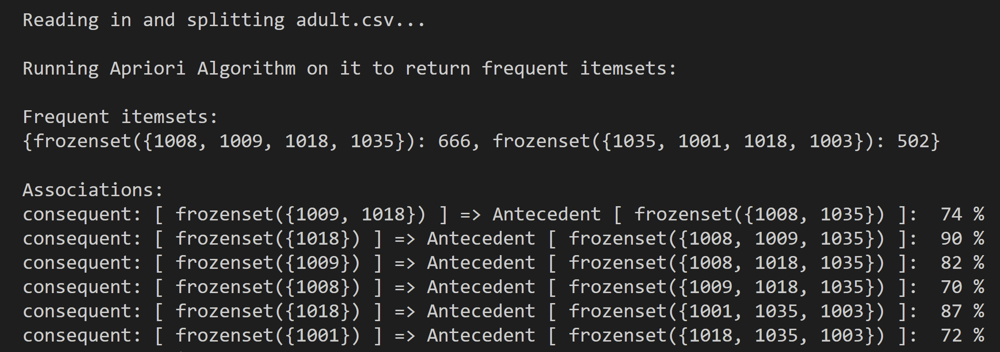

# Implementation Overview:

Market Basket Analysis (MBA) is a method of data mining used in various ‘recommender’ systems. These systems contain algorithms that determine patterns in users' purchasing/browsing activity, which MBA uses to recommend products and services as effectively and accurately as possible. One of the most common algorithms associated with market basket analysis is the Apriori algorithm, which gathers a very large set of association rules (which are essentially “if-then” statements) in order to create a more efficient market, resulting in more sales. However, a crucial aspect of creating a successful market basket analysis is to distinguish ‘interesting’ association rules from the ‘uninteresting’ and potentially misleading ones.

This project includes a classic implementation of Apriori in Python, however modified to allow efficient hashing for candidate itemset frequency counting. The program also includes code to find association rules between the itemsets determined to be frequent. MBA is performed on a publicly available dataset of websites visited in a day by anonymous microsoft users. More information regarding the dataset is available [here](https://archive.ics.uci.edu/ml/datasets/Anonymous+Microsoft+Web+Data).

### Apriori - An Overview:

The basic idea behind this algorithm is to use a bottom-up approach, where k frequent subsets of items are used to generate candidate sets of k+1 itemsets (using prior itemset knowledge) until no more frequent itemsets can be found. The algorithm uses a minimum support threshold to determine the minimum frequency of an itemset to be considered frequent. Based on these frequent itemsets generated from the algorithm, association rules are thereby generated using a minimum confidence threshold to allow filtering of weaker associations.

#### Here are the main steps of the algorithm, where k is the initial size 1 of the candidate itemsets:

1. Scan the database to determine the frequency of each item.
2. Use the frequent items to generate candidate sets of size k+1.
3. Scan the database to determine the frequency of each candidate set.*
4. Remove any candidates that have a frequency less than the minimum support threshold.
5. Increment the k value.
6. Repeat steps 2-5 until no more frequent itemsets can be found.
7. Use the frequent itemsets to generate association rules.
8. Use a confidence threshold to determine the minimum confidence of an association rule to be considered strong.
9. Finally, output the strong association rules.

**In this particular implementation, the counts are stored in a hash table where the sets are frozen to act as keys with corresponding frequencies as values.*

As mentioned before, the implementation in this program is identical to the classic one shown below, with the exception of hashing used in the frequency count process to make the database search more efficient. This was based off of a [study](http://ijariie.com/AdminUploadPdf/MODIFIED_APRIORI_ALGORITHM_USING_HASH_BASED_TECHNIQUE_ijariie2352.pdf) that used the method to decrease the time complexity and cut memory usage by nearly half in each candidate generation stage.

### Preparing the MS-Web Data:

Prior to calling the algorithm, the dataset was stored into corresponding data structures to allow efficient access of both the transactions and items. This was done by first extracting the attribute and item data into corresponding data frames. The attribute data frame was then used to create the item_data list seen in MBA.py which contains a list of all the attributes. The item data, however, is stored in a slightly more complex dictionary structure where the key is the transaction ID (ie. UserID) with the values set as the list of corresponding items (ie. Attributes). This is primarily to allow efficient database scans when counting itemset supports. These user based “transactions” with their corresponding items, along with a list of all the possible items from the dataset, are passed to the Apriori class during its initialization along with an integer value for the minimum support threshold.

### Output Sample:

